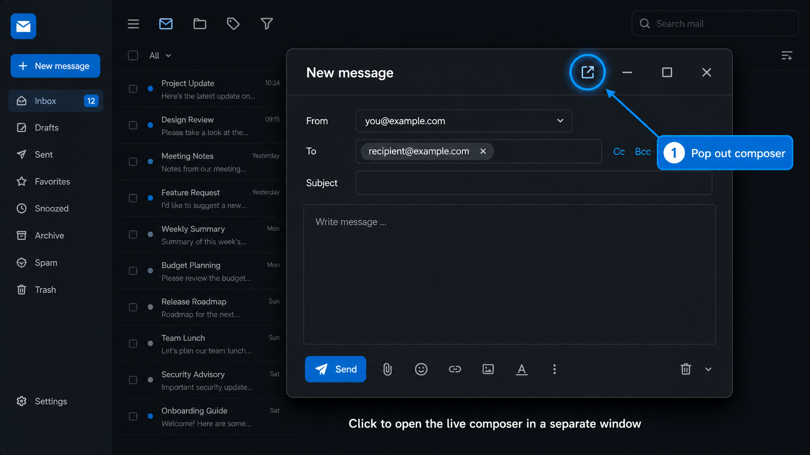

# Mail Pop-out

Mail Pop-out turns the Nextcloud Mail composer into a draggable, resizable floating window. The open-in-new-window button in the composer header can move that same live composer into a separate browser window.

- Author: pmpksamy
- Website: https://pmpksamy.com
- App URL: https://pmpksamy.com/nextcloud_app/mail_popout
- Documentation: https://pmpksamy.com/nextcloud_app/mail_popout
- Contact: [Maalig@pmpksamy.com](mailto:Maalig@pmpksamy.com)

Repository: https://github.com/iampmpksamy/NextCloud_Mail_PopOut_Plugin

[Wiki and user guide](https://github.com/iampmpksamy/NextCloud_Mail_PopOut_Plugin/wiki)



The blue callout identifies the new-window control. Select it to move the live Mail composer into a separate browser window without replacing Mail's draft or send workflow.

Because the app moves Mail's existing composer instead of replacing it, Mail remains responsible for autosaved drafts, recipients, the rich-text editor, attachments, sending, minimizing, and closing.

## Compatibility

- Nextcloud 32 through 35
- Mail 5.10's modal composer (the interface shown in the reference screenshot)
- Mail 5.11's newer floating composer
- Current Chromium, Firefox, and Safari releases with JavaScript enabled

The number of simultaneous composers is still controlled by Mail. Mail 5.10 and 5.11 provide one active composer session per Mail page.

## Install

See the complete [installation and update guide](INSTALL.md) for standard Nextcloud, Nextcloud AIO, Docker, verification, and troubleshooting instructions.

For an existing Nextcloud installation, place this directory at `custom_apps/mail_popout`, then run from the Nextcloud installation directory:

```bash
sudo -u www-data php occ app:enable mail_popout
```

Reload the Mail page. If the browser blocks the separate window, allow pop-ups for the Nextcloud origin. The composer remains available as an in-page floating window even when a browser pop-up is blocked.

## Use

- Open a new message, reply, forward, or draft normally.
- Drag the composer by its title bar.
- Resize it from the lower-right browser resize handle.
- Select the open-in-new-window icon to detach it into a browser window.
- Select the same icon again, close the browser window, or use **Return** in Mail to dock it back into the Mail page.
- Mail's minimize and close buttons keep their native behavior, including draft saving.

The most recent in-page position and size are saved locally in the browser.

## Support

Report reproducible problems at https://github.com/iampmpksamy/NextCloud_Mail_PopOut_Plugin/issues.

- Email: [Maalig@pmpksamy.com](mailto:Maalig@pmpksamy.com)
- Website: https://pmpksamy.com
- Documentation: https://pmpksamy.com/nextcloud_app/mail_popout

## Validation

Run:

```bash
bash tests/run-smoke.sh
bash tests/run-browser-smoke.sh
```

For a live check, enable the app, open Mail, start a message, and verify dragging, resizing, detaching, returning, draft saving, attachment menus, sending, minimizing, and closing.
